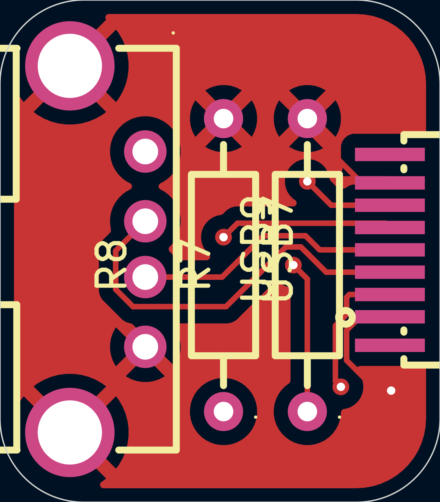
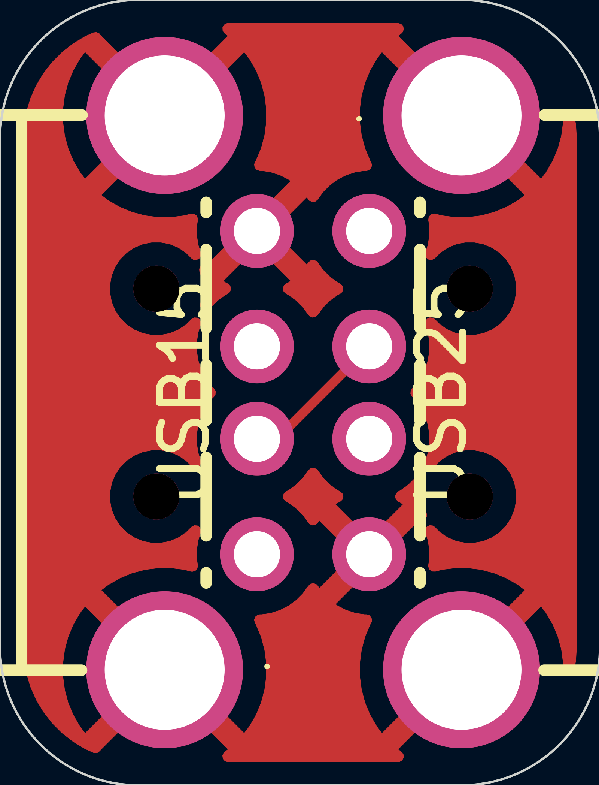
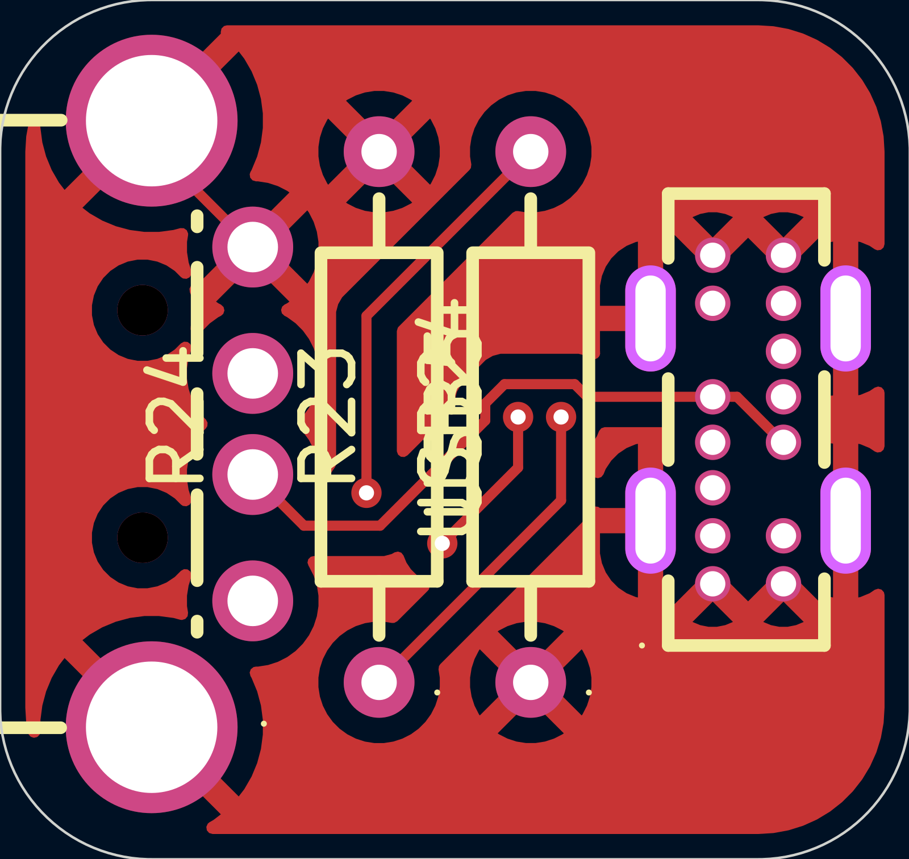
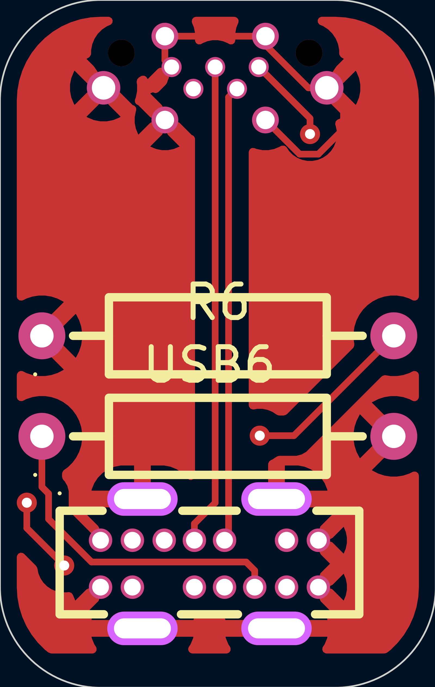

# dapt

## [Please read] About cost.

## Images

There are no other enclosures, so this is the 3D model too. A STEP export is at `dapt.step`

## What is this project?

dapt is a family of USB adapters. 

There are some opinionated choices that were made:

- Fully passive and chipless. This means that it's just the bare USB protocol: GND, VCC, D+, D-. This also means that you lose out on PD and USB3.0. It's out of scope, but it's what makes this so universal. The only component other than the connectors are some 5.1k resistors that are required for all USB-C to work. 
- tht (for now). This is so that it's hand-solderable.
- just USB. It doesn't try to do too much.

I made dapt because I wanted some dead-simple USB adapters, and I thought it'd be a fun project.

## Schematics

| Variant | Schematic |
|---------|-----------|
| A female to A female |  |
| A female to C male |  |
| A male to A male |  |
| A male to C female |  |
| C female to C female |  |
| C female to micro male |  |

## PCB

| Variant | PCB |
|---------|-----|
| A female to A female |  |
| A female to C male |  |
| A male to A male |  |
| A male to C female |  |
| C female to C female |  |
| C female to micro male |  |

## Production files

in `PCB/exported_variants/gerbers`. A bit unique because this is multiple boards/variants in one.

## BOM

Please see the *about cost* section.

|Item                     |link                                                                                        |qty|extended price|notes                                          |
|-------------------------|--------------------------------------------------------------------------------------------|---|--------------|-----------------------------------------------|
|C male A female board    |N/A                                                                                         |20 |5.1           |                                               |
|A male A male board      |N/A                                                                                         |5  |4.2           |                                               |
|C female C female board  |N/A                                                                                         |5  |2.1           |                                               |
|A male C female board    |N/A                                                                                         |10 |5.2           |                                               |
|C female micro male board|N/A                                                                                         |10 |5.5           |                                               |
|USB A male               |https://www.lcsc.com/product-detail/C404965.html?s_z=n_q_C404965&globalKeyword=C404965      |15 |1.33          |                                               |
|USB A female             |https://www.lcsc.com/product-detail/C456018.html?s_z=n_q_C456018&globalKeyword=C456018      |20 |0.97          |                                               |
|USB C male               |https://www.lcsc.com/product-detail/C22355747.html?s_z=n_q_C22355747&globalKeyword=C22355747|20 |5.85          |                                               |
|USB C female             |https://www.lcsc.com/product-detail/C22384780.html?s_z=n_q_C22384780&globalKeyword=C22384780|30 |8.53          |                                               |
|micro male               |https://www.lcsc.com/product-detail/C7407276.html?s_z=n_q_C7407276&globalKeyword=C7407276   |10 |11.75         |                                               |
|lcsc + jlc shipping      |N/A                                                                                         |1  |0             |shipping free bc imma order it with other stuff|
|total                    |N/A                                                                                         |1  |50.53         |                                               |
