# dapt

## [Please read] About cost.

So looking at the bom, you can see that it's super expensive, like $50. You might be thinking, "what's going on there? I thought this project was explicitly focused on being low-cost!"

There are a few points I'd like to preempt.

1. I'm not going to spend $50 building this, and if I do so it'll be fine because I can pay out of pocket. That's the BOM for the souped-up set of ALL the adapters in large quantities. I'm going to pick and choose which ones to do, and do it in small quantities. I'm going to end up paying like $15 personally. 
2. There's not really a way to BOM-optimize. Contention genuinely is really high, because LCSC doesn't specialize in THT hobby-solderable components. USB-C SMD genuinely cannot be hand-soldered without a hot plate. If you're trying to make 100 of these, please just buy PCBA and get dirt-cheap SMD components. Right now THT pricing is hit-or-miss. Some are dirt cheap, others are not. 
3. I *could* swap everything out for SMD and order PCBA myself, but at that point it's genuinely a different project. This is what there is. 

## Images

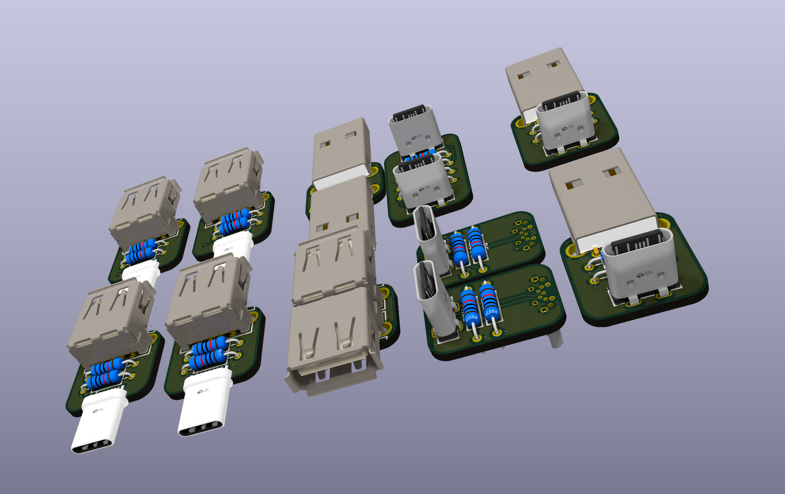

There are no other enclosures, so this is the 3D model too. A STEP export is at `dapt.step`

## What is this project?

dapt is a family of USB adapters. 

There are some opinionated choices that were made:

- Fully passive and chipless. This means that it's just the bare USB protocol: GND, VCC, D+, D-. This also means that you lose out on PD and USB3.0. It's out of scope, but it's what makes this so universal. The only component other than the connectors are some 5.1k resistors that are required for all USB-C to work. 
- tht (for now). This is so that it's hand-solderable.
- just USB. It doesn't try to do too much.

I made dapt because I wanted some dead-simple USB adapters, and I thought it'd be a fun project.

Current adapters:
- A female to A female
- A female to C male
- A male to A male
- A male to C female
- C female to C female
- C female to micro male

## Schematics

| Variant | Schematic |
|---------|-----------|
| A female to A female | 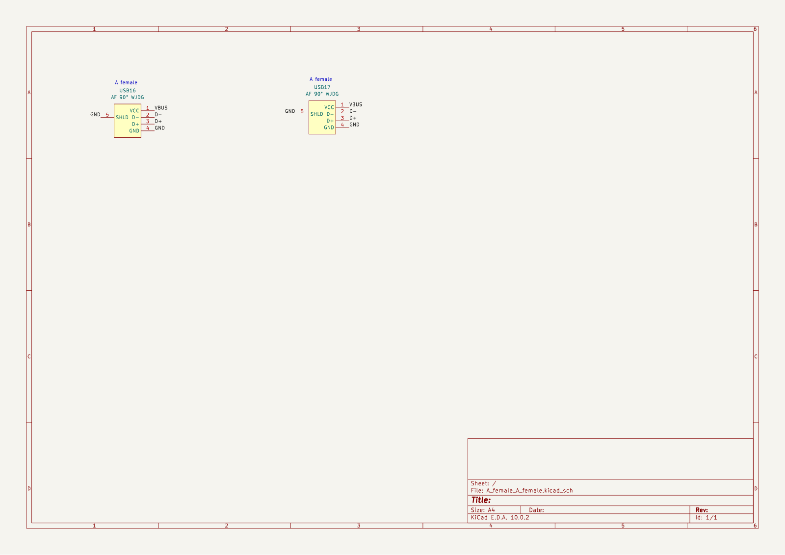 |
| A female to C male | 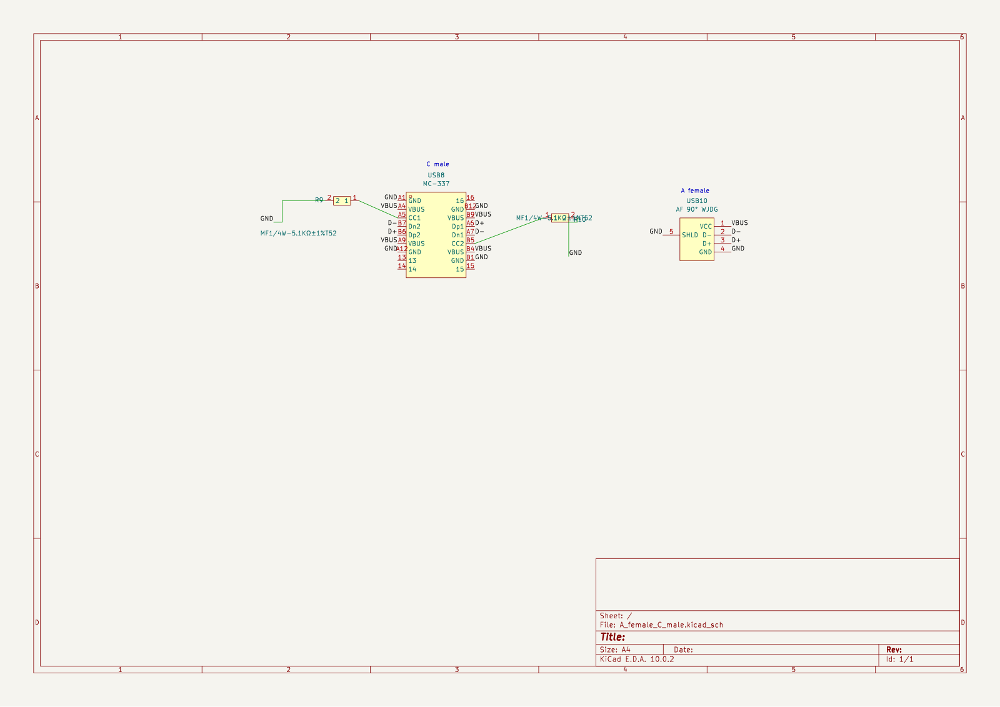 |
| A male to A male | 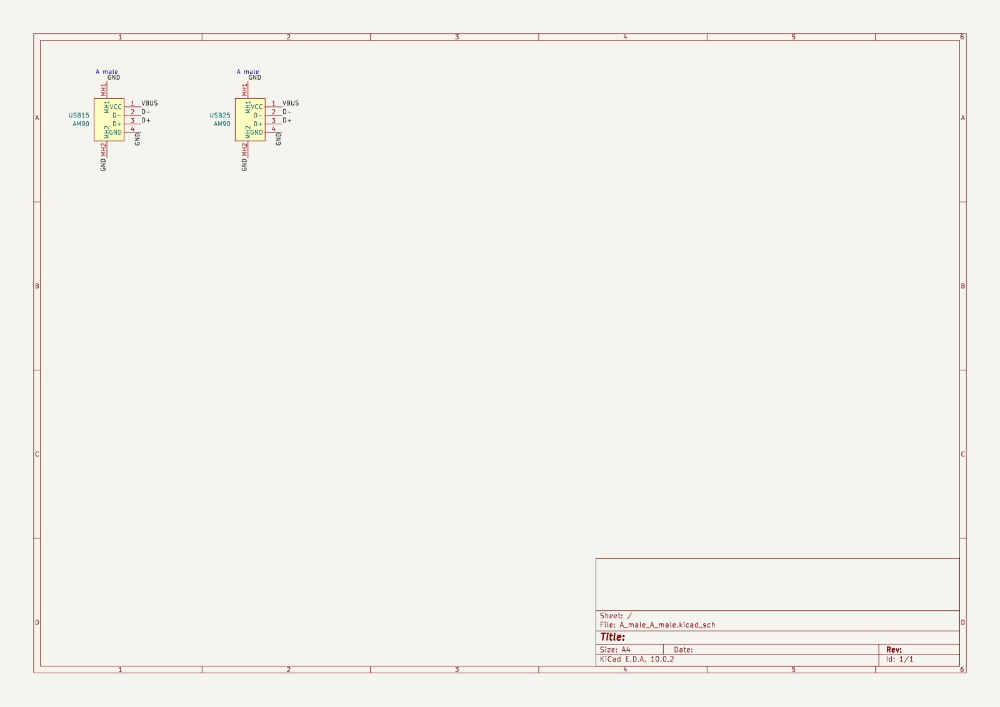 |
| A male to C female | 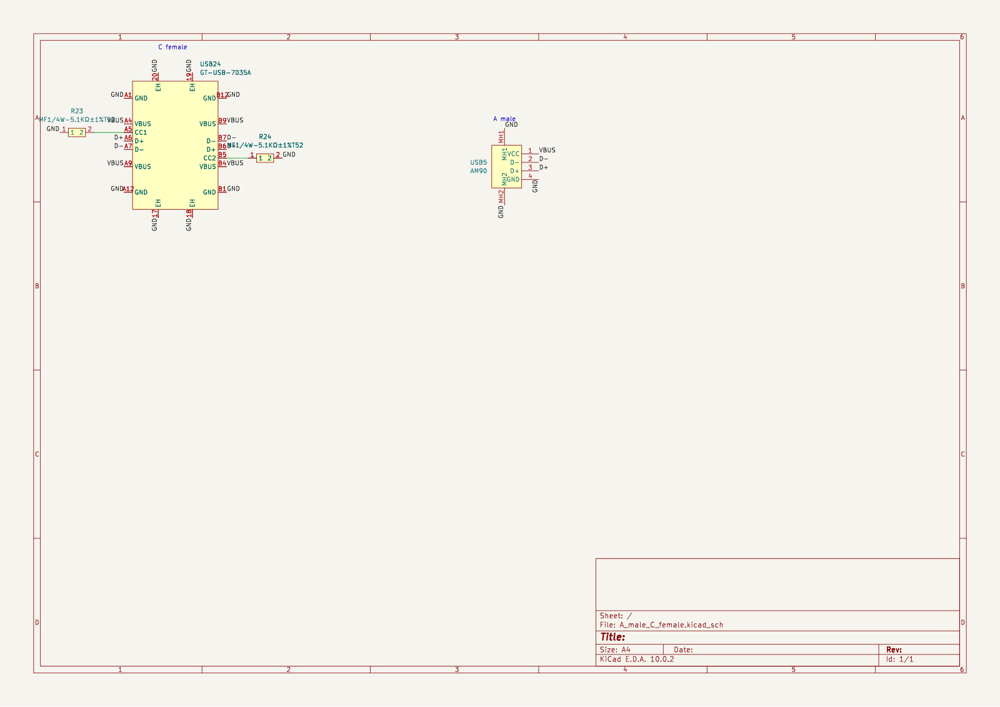 |
| C female to C female | 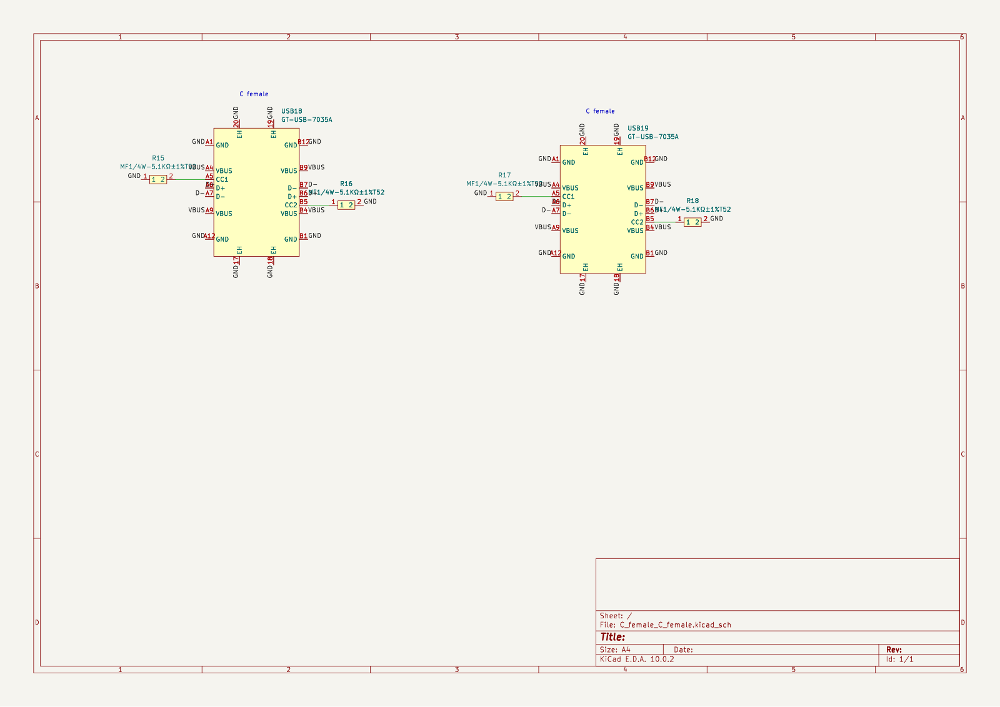 |
| C female to micro male | 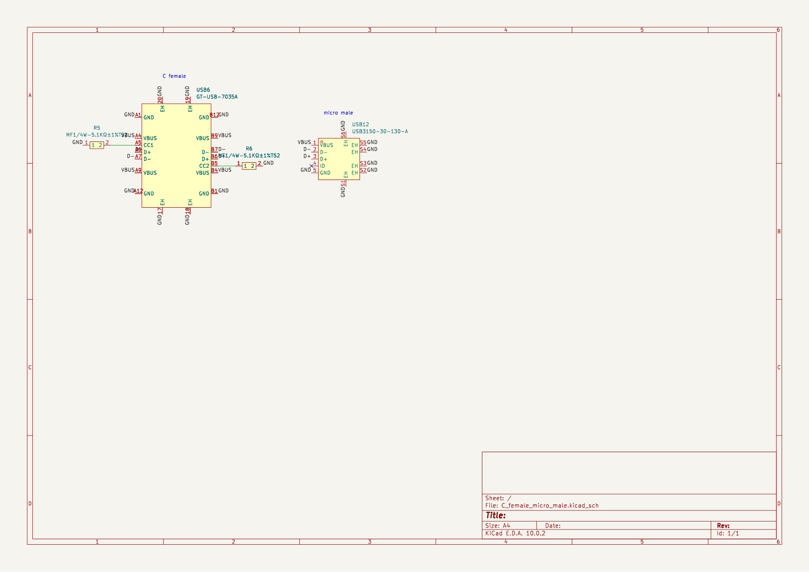 |

## PCB

| Variant | Front | Back |
|---------|-------|------|
| A female to A female | 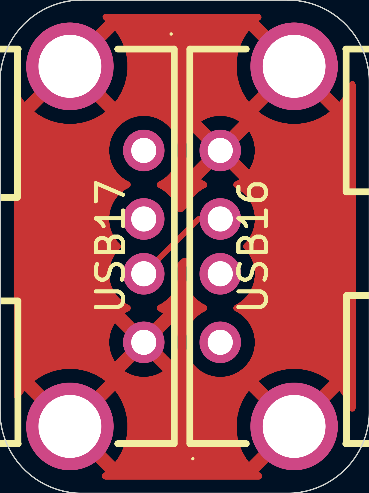 |  |
| A female to C male |  | 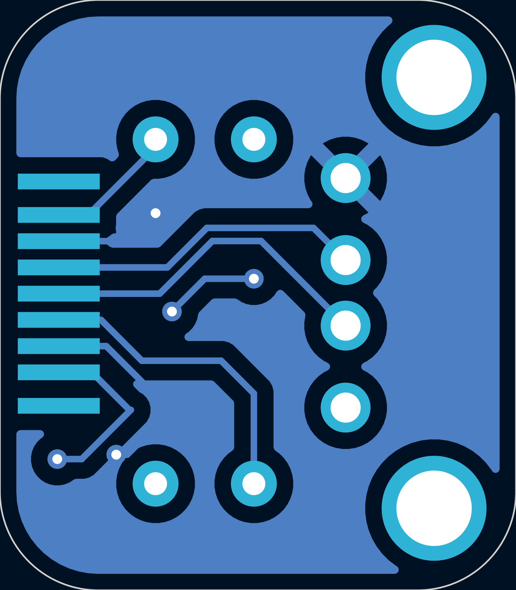 |
| A male to A male |  | 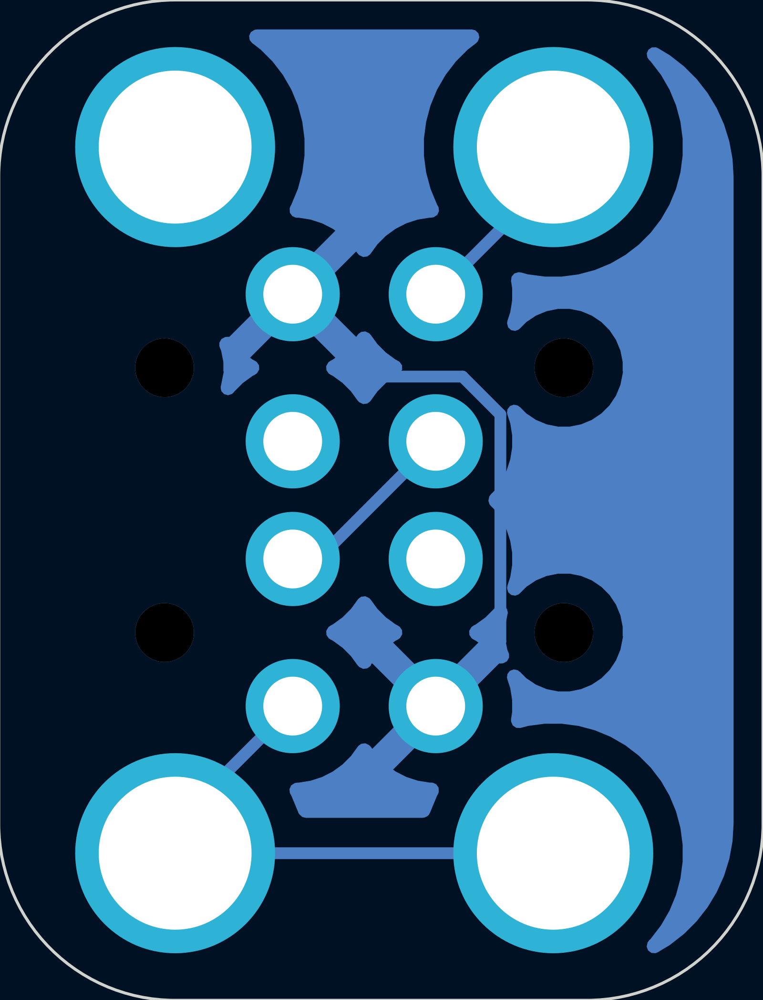 |
| A male to C female |  | 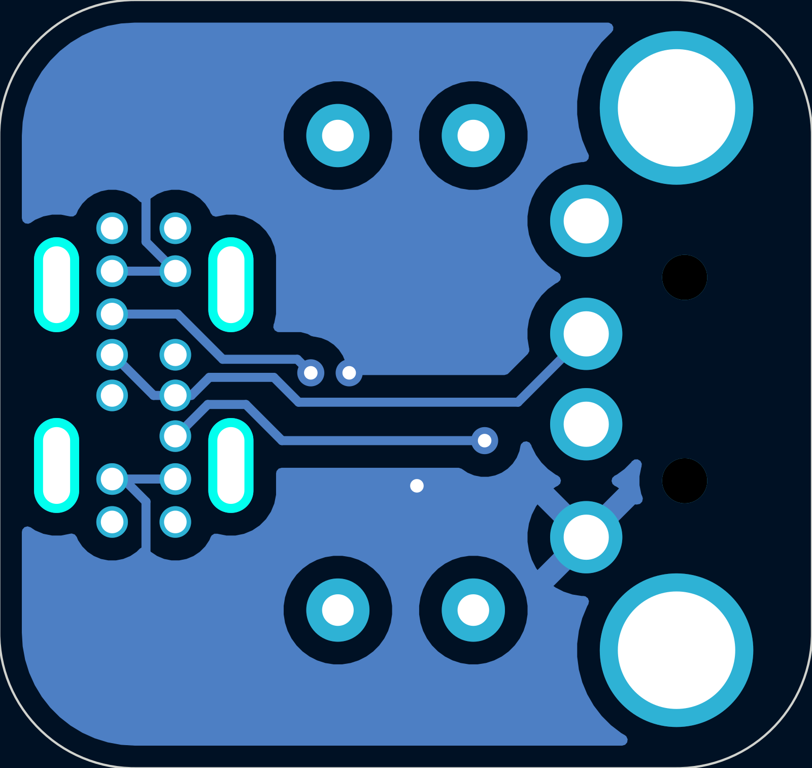 |
| C female to C female | 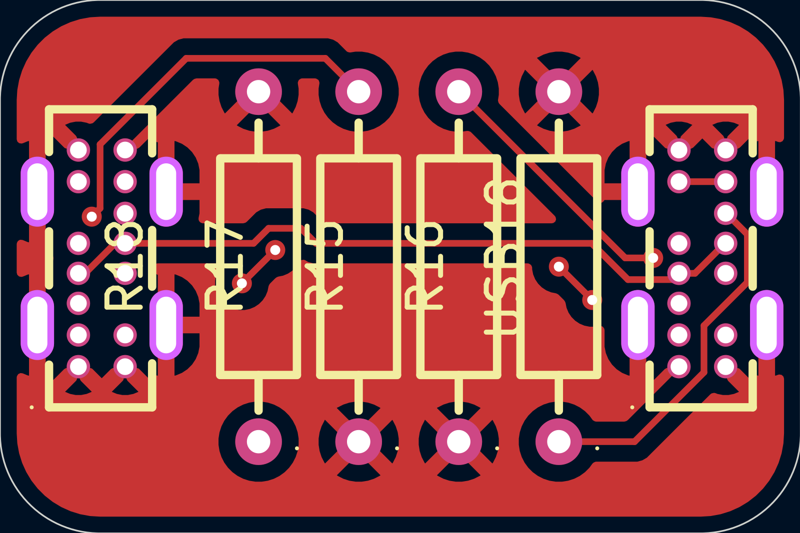 | 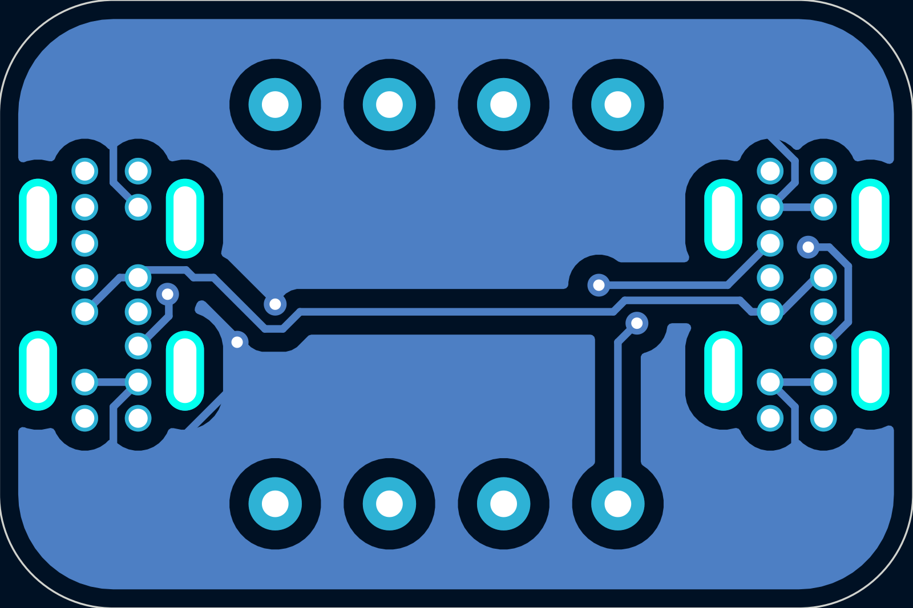 |
| C female to micro male |  | 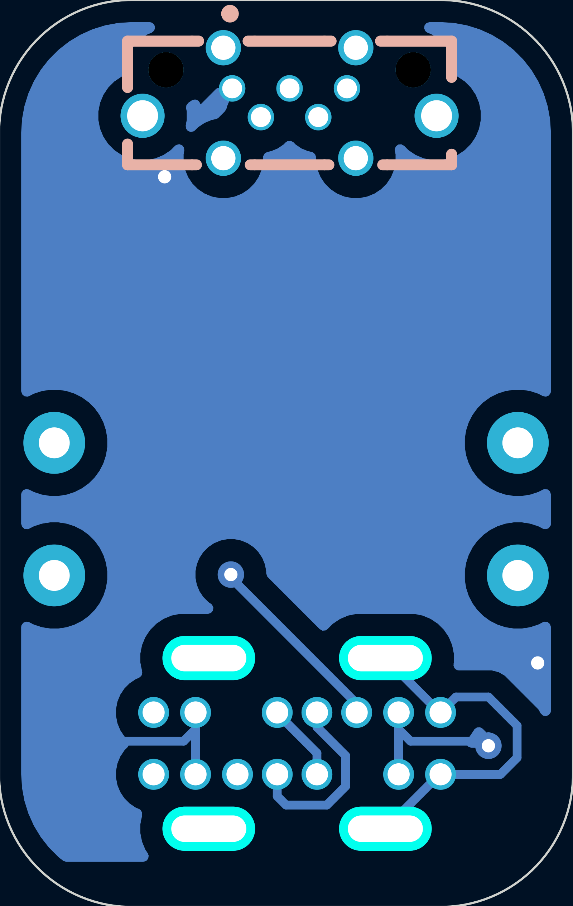 |

## Production files

in `PCB/exported_variants/gerbers`. A bit unique because this is multiple boards/variants in one.

## BOM

Please see the *about cost* section.

|Item                     |link                                                                                        |qty|extended price|notes                                          |
|-------------------------|--------------------------------------------------------------------------------------------|---|--------------|-----------------------------------------------|
|C male A female board    |N/A                                                                                         |20 |5.1           |                                               |
|A male A male board      |N/A                                                                                         |5  |4.2           |                                               |
|C female C female board  |N/A                                                                                         |5  |2.1           |                                               |
|A male C female board    |N/A                                                                                         |10 |5.2           |                                               |
|C female micro male board|N/A                                                                                         |10 |5.5           |                                               |
|USB A male               |https://www.lcsc.com/product-detail/C404965.html?s_z=n_q_C404965&globalKeyword=C404965      |15 |1.33          |                                               |
|USB A female             |https://www.lcsc.com/product-detail/C456018.html?s_z=n_q_C456018&globalKeyword=C456018      |20 |0.97          |                                               |
|USB C male               |https://www.lcsc.com/product-detail/C22355747.html?s_z=n_q_C22355747&globalKeyword=C22355747|20 |5.85          |                                               |
|USB C female             |https://www.lcsc.com/product-detail/C22384780.html?s_z=n_q_C22384780&globalKeyword=C22384780|30 |8.53          |                                               |
|micro male               |https://www.lcsc.com/product-detail/C7407276.html?s_z=n_q_C7407276&globalKeyword=C7407276   |10 |11.75         |                                               |
|lcsc + jlc shipping      |N/A                                                                                         |1  |0             |shipping free bc imma order it with other stuff|
|total                    |N/A                                                                                         |1  |50.53         |                                               |
